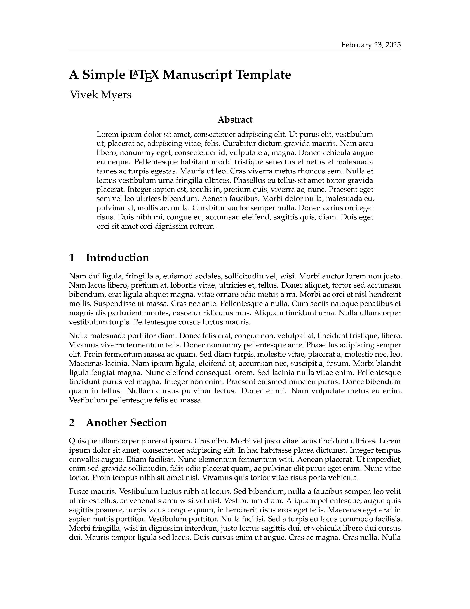
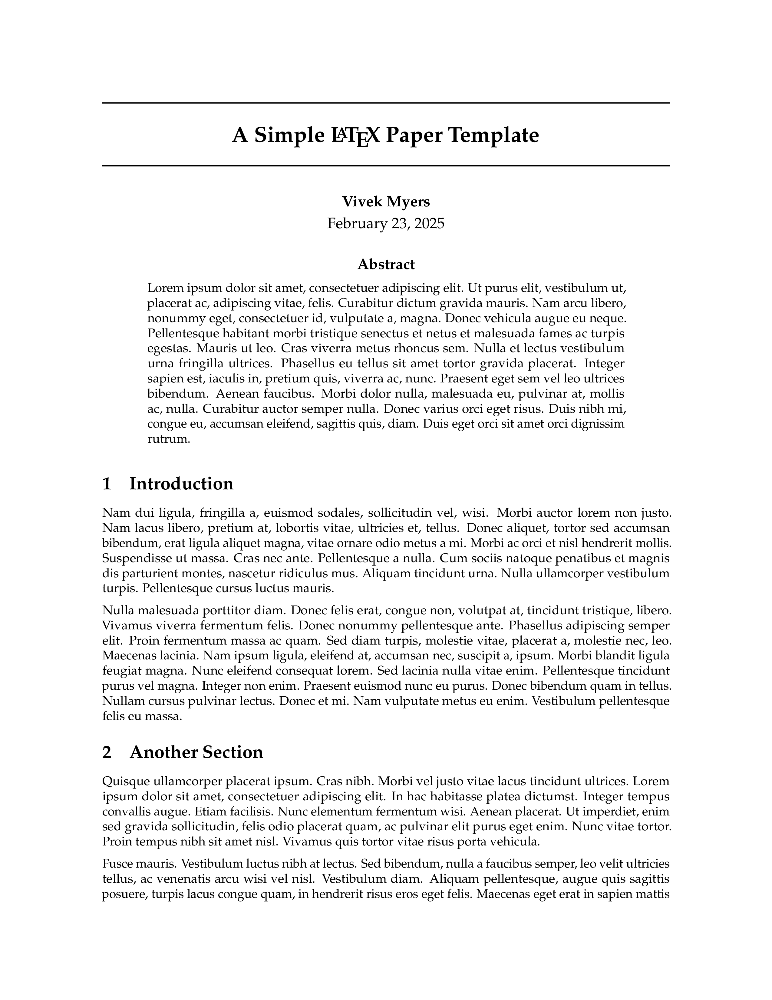
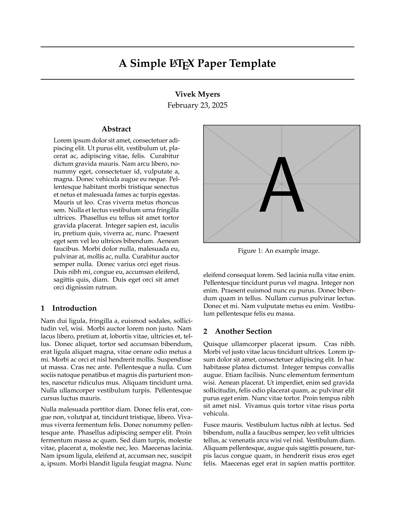
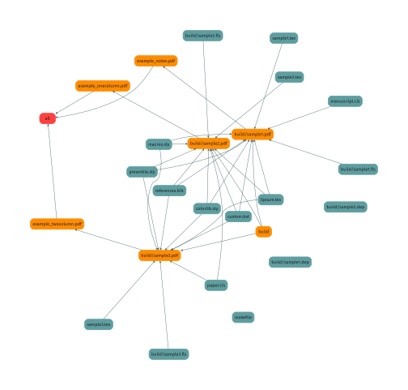

## Minimalist LaTeX Templates

A collection of macros and documentclasses for notes and papers.

### Examples

These correspond to `sample1.tex`, `sample2.tex`, and `sample3.tex`.

&nbsp;&nbsp;&nbsp;
&nbsp;&nbsp;&nbsp;

### Build structure

See diagram below for the build described by the `makefile`.

&nbsp;&nbsp;&nbsp;

